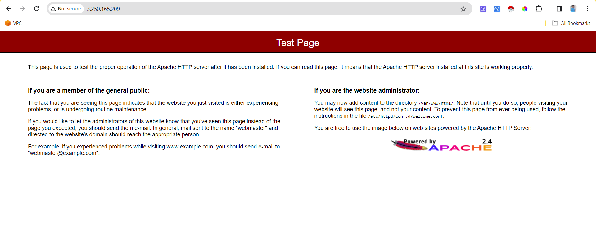

# INTRODUCTION
Ansible  is an open-source software provisioning, configuration management, and application-deployment platform. For this project it was used to create AWS EC2 instance.

## PRE-REQUISITE
To  run this project, you need to have the following installed:
- python3
- pip (python package installer)
- boto3
- botocore
- ansible-galaxy collection install amazon.aws
- software-properties-common && python-apt-common
- ansible

# BREAKDOWN OF ANSIBLE TASK
For this task a custom ansible-directory was created to execute this task. The `ansible directory` contains files and sub directories.

The configuration file was used to  establish the path to the private-keys of the local machine and to set the host-key-checking to false.

The inventory file contains the server that will be used to create this task 

The roles folder was used to modularise the task so that the file can be reusable by other engineers

### ANSIBLE-ROLES
**For this project roles were created for every element necessary to create the:**
- VPC
- EC2
- and to install a web server

**For the VPC we have:**
- VPC
- subnets
- internet gateway
- route-tables.

**For the EC2 compute instance we have:**
- security group
- ami (The task specification was to get the latest Amazon-Linux ami in the region)
- key-pair (I used a different key name cause I didn't retrieve the private key file of `MyKeyPair`)
- ec2

**For the webserver, we have:**
- update-pkg: To update yum packages
- install-pkg: To install apache2
- start-services: To start and enable apache2

Because this task is simple, the sub-directory used in each role was only the `tasks` and `var`.

The `main.yml` in the `var` directory holds the variables for each role while the `main.yml` in the `tasks` directory holds the pieces of code needed to create each element of the infrastructure.

Another variable type was also used and captured with the `Register` keyword. This made it possible to reference roles in other roles. e.g referencing vpc-id in the subnets or internet gateway role.

The main playbook `role.yml` contains two plays which are:
- To create VPC and EC2 
- To install and start a web server.

## COMMANDS USED FOR EXECUTION
- To create roles `ansible-galaxy init <role-name>` was used.
- To execute the main playbook `ansible-command -i hosts.ini role.yml`

## PROOF OF WEB SERVER IN EC2

